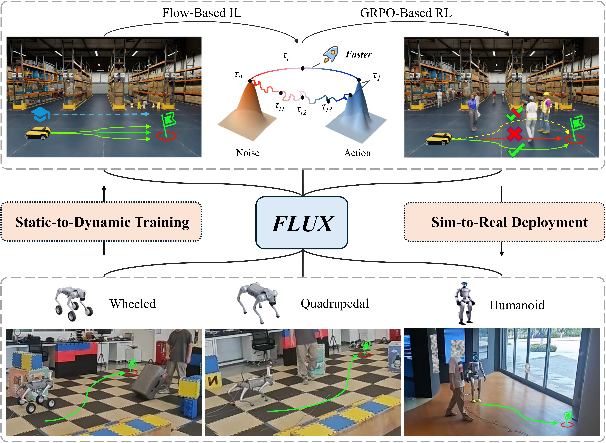

<p align="center">
<h1 align="center"><strong>FLUX: Accelerating Cross-Embodiment Generative Navigation Policies via Rectified Flow and Static-to-Dynamic Learning</strong></h1>
  <p align="center">
    <a href='https://zeying-gong.github.io/' target='_blank'>Zeying Gong</a><sup>1*</sup>&emsp;
    <a href='' target='_blank'>Yangyi Zhong</a><sup>1*</sup>&emsp;
    <a href='https://www.linkedin.com/in/ding-justin-08a421266' target='_blank'>Yiyi Ding</a><sup>1*</sup>&emsp;
    <a href='https://hutslib.github.io/' target='_blank'>Tianshuai Hu</a><sup>2</sup>&emsp;
    <a href='https://guoyangzhao.github.io/' target='_blank'>Guoyang Zhao</a><sup>1</sup>&emsp; <br>
    <a href='https://ldkong.com/' target='_blank'>Lingdong Kong</a><sup>3</sup>&emsp; 
    <a href='https://rongli.tech/' target='_blank'>Rong Li</a><sup>1</sup>&emsp;
    <a href='www.linkedin.com/in/jiadi-you-2362a6354' target='_blank'>Jiadi You</a><sup>1</sup>&emsp;
	<a href='https://junweiliang.me/' target='_blank'>Junwei Liang</a><sup>1,2,&#9993;</sup>&emsp;
    <br>
    <sup>1</sup>The Hong Kong University of Science and Technology (Guangzhou)&emsp; 
    <sup>2</sup>The Hong Kong University of Science and Technology&emsp; <br>
    <sup>3</sup>National University of Singapore&emsp;
    <br>
    * Equal Contribution
  </p>
</p>

<div id="top" align="center">

[](https://zeying-gong.github.io/projects/flux/)
[](https://arxiv.org/abs/2603.12806)
[](https://www.youtube.com/watch?v=cY6tFvKgTjo)
</div>

# 🏡 Introduction
FLUX is the first flow-based unified navigation policy that achieves state-of-the-art performance across six fundamental navigation tasks. By linearizing probability flow, FLUX replaces iterative denoising with straight-line trajectories, improving per-step inference efficiency by 47% over prior flow-based methods and 29% over diffusion-based ones. Our static-to-dynamic training curriculum enables efficient, socially-aware navigation, which transfers zero-shot across three heterogeneous platforms (wheeled, quadrupedal, and humanoid) in the real world without any platform-specific fine-tuning.
<div style="text-align: center;">
    
</div>

### 🛠️ Installation
Please follow the instructions to config the environment for FLUX.

Step 0: Clone this repository
```bash
git clone https://github.com/Zeying-Gong/FLUX.git
cd FLUX/
```

Step 1: Create conda environment and install the dependency
```bash
conda create -n flux python=3.10
conda activate flux
pip install -r requirements.txt
```

### 🤖 Run FLUX Model
Run the following line to start the FLUX server:
```bash
python flux_server.py --port 8888 --checkpoint ./checkpoints/flux_checkpoint.ckpt 
```


### 💻 Running Baseline as Server
For each pre-built baseline methods, each contains a server.py file, just simply run server python script with parsing the server port as well as the checkpoint path. Taking NavDP as an example:
```bash
# please first download the checkpoint from the above link
cd baselines/flux/
python navdp_server.py --port 8888 --checkpoint ./checkpoints/navdp_checkpoint.ckpt 
```

### 🕹️ Running Teleoperation
```bash
# Teleoperation commands
python teleop_pointgoal_wheeled.py
```

### 📊 Running Evaluation
```bash
# Evaluation commands
python eval_pointgoal_wheeled.py --port {PORT} --scene_dir {ASSET_SCENE}
```

# 🔗 Citation

If you find our work helpful, please cite:
```bibtex
@article{gong2025flux,
    title     = {FLUX: Accelerating Cross-Embodiment Generative Navigation Policies via Rectified Flow and Static-to-Dynamic Learning},
    author    = {Gong, Zeying and Zhong, Yangyi and Ding, Yiyi and Hu, Tianshuai and Zhao, Guoyang and Kong, Lingdong and Li, Rong and You, Jiadi and Liang, Junwei},
    journal   = {arXiv preprint arXiv:2603.12806},
    year      = {2025}
}
```

# 👏 Acknowledgement
We thank the authors of [NavDP](https://github.com/InternRobotics/NavDP) for their excellent open-source codebase.
